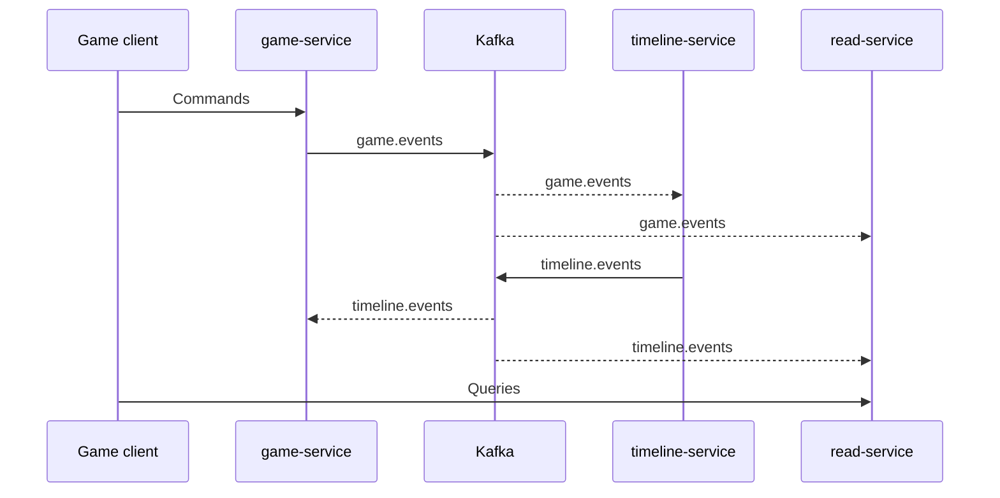

<div align="center">
  <a href="https://github.com/temporal-rift">
    
  </a>

  <p><strong>Influence the past. Control the future. Don't reveal yourself.</strong></p>

  <p>
    A 3–5 player hidden-faction strategy game<br>
    and a production-grade event-driven systems showcase.
  </p>

  <p>
    <a href="https://github.com/temporal-rift/docs/blob/master/introduction.mdx">Explore the game</a>
    ·
    <a href="https://github.com/temporal-rift/docs/tree/master/architecture">Read the architecture</a>
    ·
    <a href="https://github.com/temporal-rift/infrastructure">Run it locally</a>
  </p>
</div>

## Shape the timeline

Temporal Rift casts each player as a time traveler with a secret faction and a private agenda. Players see future events before they happen, then play cards and faction abilities in the past to shift their outcomes. Conflicting actions create paradoxes that must be resolved before time can move forward.

The platform turns those mechanics into an intentional distributed-systems design. It uses domain-driven design, CQRS, event sourcing, sagas, transactional outboxes, and idempotent Kafka consumers to model a timeline that can branch, conflict, and recover.

## The system



- **`game-service`** orchestrates lobbies, game sessions, action rounds, and scoring as a Spring Modulith application.
- **`timeline-service`** owns probability math, outcome resolution, paradoxes, and future-event state in an event-sourced domain.
- **`read-service`** consumes domain events into per-player CQRS projections and serves the query side.
- **`apis`** publishes independently versioned OpenAPI and AsyncAPI contracts used for build-time code generation.

Services are independently deployable, own their PostgreSQL data, and communicate through Kafka events partitioned by game.

## Repositories

| Repository | Purpose |
| --- | --- |
| [`game-service`](https://github.com/temporal-rift/game-service) | Game orchestration, sessions, player actions, and scoring |
| [`timeline-service`](https://github.com/temporal-rift/timeline-service) | Event-sourced timeline resolution and paradox handling |
| [`read-service`](https://github.com/temporal-rift/read-service) | CQRS projections and player-facing game-state queries |
| [`apis`](https://github.com/temporal-rift/apis) | Spec-first REST and event contracts |
| [`infrastructure`](https://github.com/temporal-rift/infrastructure) | Local platform stack and end-to-end verification |
| [`temporal-rift-bom`](https://github.com/temporal-rift/temporal-rift-bom) | Shared Java build, quality, and dependency conventions |
| [`docs`](https://github.com/temporal-rift/docs) | Game design, architecture, API, event, and saga documentation |
| [`simulation-workbench`](https://github.com/temporal-rift/simulation-workbench) | Reproducible simulation experiments, bot policies, and balance analysis for designers |

## Technology

`Java 26` · `Spring Boot 4` · `Spring Modulith` · `Apache Kafka` · `PostgreSQL` · `Liquibase` · `OpenAPI` · `AsyncAPI` · `Docker Compose`

## Run locally

The [`infrastructure`](https://github.com/temporal-rift/infrastructure) repository provides the complete local stack: all three services, isolated PostgreSQL databases, Kafka, Kafka UI, Zipkin, and Seq.

```bash
git clone https://github.com/temporal-rift/infrastructure.git
cd infrastructure
docker compose up --build
```

Service development requires Java 26 and Maven 3.9.13 or newer. See each repository's README for its focused build and test workflow.

## Project status

Temporal Rift is under active development. The backend, contracts, and game rules are evolving together as the system and game are refined. If you would like to explore or contribute, start with the documentation and the open issues in the relevant repository.
